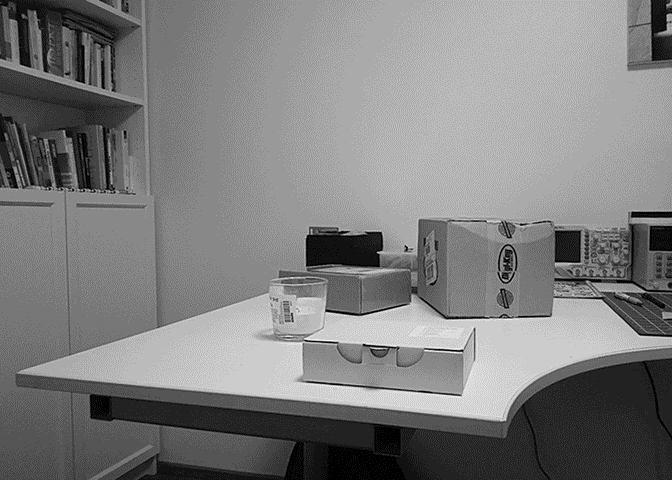
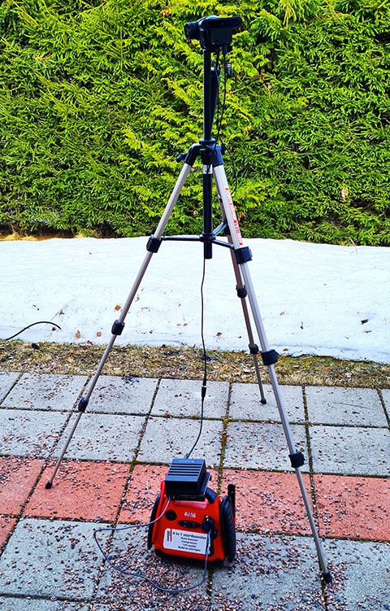
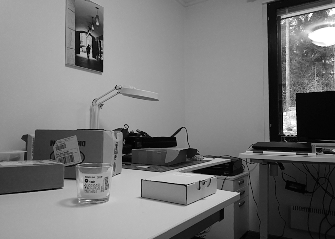
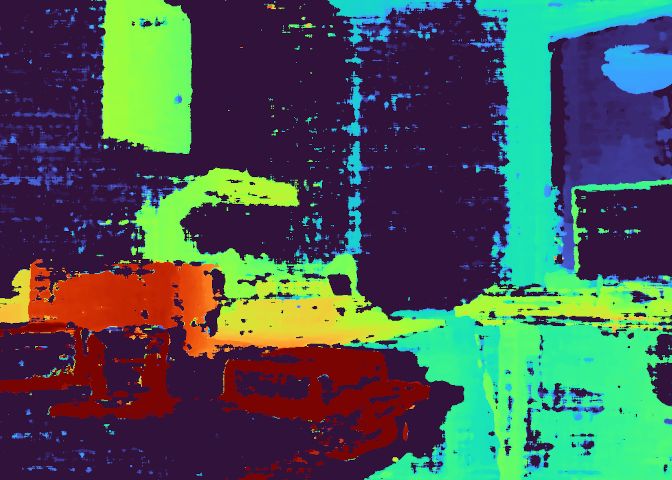
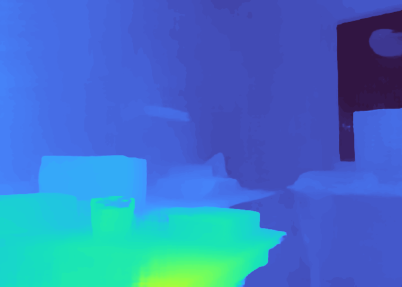

<div id="top"></div>

# Real-Time Deep Learning Based Stereo Reconstruction



This repository contains the code for Msc Thesis paper "Real-time Deep-learning based Stereo Reconstruction",
in which a portable stereo reconstruction solution is built. 


## Solution structure

The solution is built using [Nvidia's Xavier](https://www.nvidia.com/en-us/autonomous-machines/embedded-systems/jetson-agx-xavier/)
embedded AI accelerator. Second part of the equation is a [OAK-D](https://store.opencv.ai/products/oak-d)
stereo camera, connected directly to the Xavier. Power is provided by
a 12v 8Ah battery, what allows about 2.5 hours of autonomous work.

Xavier runs Ubuntu Linux. Software part of the solution is an 
optimized version of the [GwcNet](https://github.com/xy-guo/GwcNet), which is executed
using TensorRT and ONNX Runtime optimizations.



## Results & Conclusions

With TensorRT optimizations it is possible to achieve a sub-second 
inference time with Nvidia Jetson Xavier AGX device and [GwcNet](https://github.com/xy-guo/GwcNet)
disparity estimation network.

|Image resolution|Disparity resolution|Precision| Inference time |
|----------------|--------------------|---------|----------------|
|480p            |96                  |Half     | 0.2s           |
|480p            |96                  |Full     | 0.6s           |
|480p            |192                 |Half     | **0.4s**       |
|480p            |192                 |Full     | 1.08s          |
|720p            |192                 |Half     | 1.2s           |
|720p            |96                  |Full     | 2.3s           |

With low resolution image and high resolution disparity it is possible to achieve
a reasonable inference rate, close to two frames per second on a portable
Xavier device.

Provided scripts allow you to reproduce the results, build your own 
optimized model with different parameters and try to run inference for a 
single image or even try a live stereo camera stream.

It may worth to try other resolutions, like SVGA or DVGA and test 
network performance on a grayscale images.

## How to use

To run the solution you need to prepare the runtime environment on Xavier device and convert the GwcNet.

Tu run the inference it's enough to only install ONNXRuntime and DepthAI SDK. 

### Preparing Xavier

First of all you need to install Jetson 4.6.1 or later with TensorRT. Earlier versions of Jetson include incompatible version of the TensorRT libraries.

The simplest way to install Jetson is to use docker based [sdk manager](https://docs.nvidia.com/sdk-manager/docker-containers/index.html):

`docker run --privileged -v /dev/bus/usb:/dev/bus/usb -it --rm sdkmanager --cli install --logintype devzone --product Jetson --version 4.6.1 --targetos Linux --host --target JETSON_AGX_XAVIER_TARGETS --flash all 00additionalsdk DeepStream,TensorRT`

Due to the requirement of the direct USB access you'll ned a real linux system to run the sdk manager, WSL2 will not work. Make sure that both CUDA and TensorRT will be installed (which is
a default option).

To get the best results every other command should be executed in the
max performance mode:

```shell
sudo nvpmodel -m 0
sudo jetson_clocks
```

#### PyTorch

PyTorch can not be installed on the Xavier device using PIP distribution 
as compiling it requires some additional patching. Fortunately,
NVIDIA provides a pre-built patched package for us:

```shell
sudo apt-get install python3-pip libopenblas-base libopenmpi-dev libomp-dev
pip3 install Cython
pip3 install Cython numpy
wget https://nvidia.box.com/shared/static/fjtbno0vpo676a25cgvuqc1wty0fkkg6.whl -O torch-1.10.0-cp36-cp36m-linux_aarch64.whl
pip3 install torch-1.10.0-cp36-cp36m-linux_aarch64.whl
```

#### ONNX

Both ONNX library and ONNX runtime require protobuf library and compiler
to be installed first:

```shell
sudo apt install libprotobuf-dev protobuf-compiler
pip3 install onnx
wget https://nvidia.box.com/shared/static/jy7nqva7l88mq9i8bw3g3sklzf4kccn2.whl -O onnxruntime_gpu-1.10.0-cp36-cp36m-linux_aarch64.whl
pip3 install onnxruntime_gpu-1.10.0-cp36-cp36m-linux_aarch64.whl
```

It is **important** to use that particular build of ONNXRuntime as it contains workaround TRT padding constants bug.

#### DepthAI

DepthAI is required for OAK-D camera support, used in live real-time demo.
Unfortunately it requires an incompatible version of OpenCV library and can not
be installed directly from the PyPi. Instead, an official "git" installer
should be used:

```shell
git clone https://github.com/luxonis/depthai-python.git
cd depthai-python
python3 install_requirements.py
echo 'SUBSYSTEM=="usb", ATTRS{idVendor}=="03e7", MODE="0666"' | sudo tee /etc/udev/rules.d/80-movidius.rules
sudo udevadm control --reload-rules && sudo udevadm trigger
```

#### Other dependencies

Polygraphy also requires special approach:

```shell
pip3 install colored polygraphy --extra-index-url https://pypi.ngc.nvidia.com
```

Other modules are trivially installable:

```shell
sudo apt install libjpeg-dev
pip3 install Pillow
```

<p style="text-align: right;">(<a href="#top">back to top</a>)</p>

### Model preparation

The GwcNet, implemented in PyTorch, needs to be converted into
ONNX format first with TRT compatible layers only. The conversion
pipeline is:

* Patch the GwcNet to get rid of operations unsupported by TRT
* Convert PyTorch model to ONNX model. At this stage input shape and 
disparity resolution are fixed in the ONNX model.
* Cleanup the model with `polygraphy`
* Convert ONNX model to the _external_ ONNX model

In ase you would like to skip the step, feel free to use the [pre-converted
ONNX model](https://mega.nz/file/xR9wESgI#Hs0Sdct22YpYWE8grU2EnjWHpeMB_woTrp0x1mdL7X8), 
with 192 disparity levels and 672x480 pixels image resolution.

#### GwcNet preparation

Clone the GwcNet:

```shell
git clone https://github.com/xy-guo/GwcNet.git
```

And apply the patch:

```shell
cd GwcNet
patch -p1 < {path to}/gwcnet.patch
```

#### Conversion to ONNX

Use provided `onnx_export.py` to get the model in the ONNX format:

```shell
python3 onnx_export.py
```

Parameters of the tool are:
```shell
  --net NET             Location of GwcNet code (./GwcNet/)
  --weights WEIGHTS     Location of pre-trained weights file (./sceneflow.ckpt)
  --width WIDTH         Input image width, should be divisible by 3 and 16 (672)
  --height HEIGHT       Input image height, should be divisible by 8 (480)
  --disparity DISPARITY Number of disparity levels (96)
  --output OUTPUT       Model output file name (model.onnx)
```

#### Network graph optimization

Polygraphy will run additional graph optimizations and will 
apply constant folding, so the model will be compatible with
TRT requirements. 

```shell
PATH=$PATH:~/.local/bin/ POLYGRAPHY_AUTOINSTALL_DEPS=1  polygraphy surgeon sanitize model.onnx --fold-constants --output model_folded.onnx
```

In case you have a large model, for example for 720p input
image, you will need an additional swap space, otherwise conversion
could be killed due to running out of RAM.

#### Converting optimized model to the external storage format

The folded model most probably will be too big to get loaded directly from the
ONNX file and it is recommended to split it into two separate files,
one for the model graph and another one with external weights:

```shell
python3 model_externalize.py --input model_folded.onnx
```

Now your ONNX model is ready for use.

<p style="text-align: right;">(<a href="#top">back to top</a>)</p>

### Single image pair disparity inference

As an example on how to run the inference please review the `single_image.py` script, that runs a TRT accelerated inference for a single image.
This script accepts following parameters:

```shell
single_image.py [-h] [--model MODEL] [--output OUTPUT] left right

  left             Left stereo image filename
  right            Right stereo image filename
  --model MODEL    ONNX file with model
  --output OUTPUT  Disparity map output filename
```

This script expects, that input images are already converted (scaled/cropped) to the input format, expected by model.





### Real-Time disparity inference

This example uses [OAK-D](https://store.opencv.ai/products/oak-d) stereo
camera to provide a real-time disparity stream. Please ensure,
that your camera is connected to the Xavier device before
running this example. The scrip accepts following parameters:

```shell
live_stereo.py [-h] [--model MODEL] [--output_prefix OUTPUT_PREFIX]

  --model MODEL         Model to use
  --output_prefix OUTPUT_PREFIX
                        Writes disparity maps to the file <prefix>_XXXXX.png
                        instead of screen output
```

<p style="text-align: right;">(<a href="#top">back to top</a>)</p>

## Contributing

Any contributions you make are **greatly appreciated**.

If you have a suggestion that would make this better, 
please fork the repo and create a pull request. 
You can also simply open an issue with your suggestions.

<p style="text-align: right;">(<a href="#top">back to top</a>)</p>

## License

Distributed under the GPLv3 License. See LICENSE.txt for more information.

Parts of the code are taken from the [GwcNet](https://github.com/xy-guo/GwcNet) Copyright (c) 2019 Xiaoyang Guo, Kai Yang, Wukui Yang, Xiaogang Wang, Hongsheng Li; distributed under MIT license.

Parts of the code are taken from the [depthai-python](https://github.com/luxonis/depthai-python) Copyright (c) 2020 Luxonis LLC; distributed under MIT license.

## Contact

Denis Chaplygin - akashihi@gmail.com or denis.chaplygin@tuni.fi

Project link: https://github.com/akashihi/RT-Stereo 